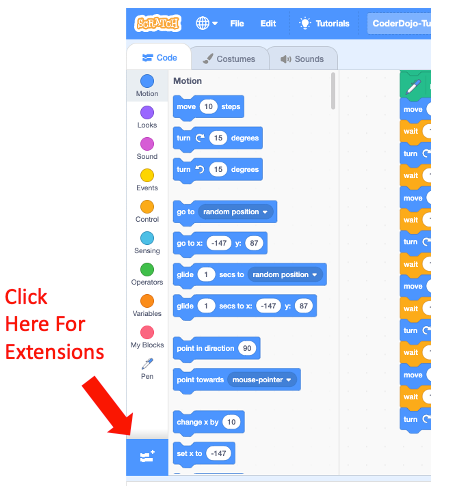
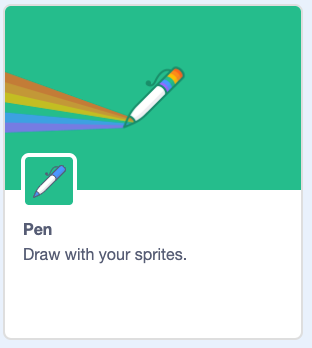
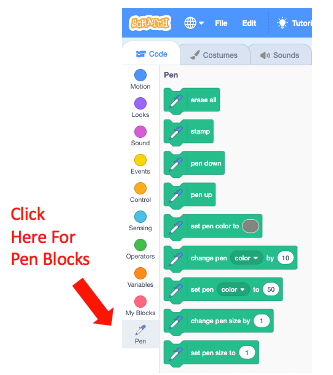

# Adding the Pen Extension

To be consistent with the other labs we are using the fast-feedback drawing with turtle graphics philosophy.  Unfortunately, the MIT Scratch 3.0 user interface does not enable the Pen drawing blocks in the default user menu.  This
must be done before you can add the "pendown" block that enables drawing.

To do this, go to the lower-left corner of the main Scratch coding page.  There will be a blue box. If you hover over it, it will
show that this is the "Add Extension" control.  You will need to click on this box.

After you click on the Add Extension control you will see a grid of extension Options.  Each one is a card that descibes the exetenion you can add.  Find the Pen Extension card and click on that card.

After you click this you must use the **Back** Icon at the top-left corner of the screen.

When you are back to the main screen you should now see the Pen blocks on the lower left of the blocks menu.

We are going to only use a few pen blocks for our fist labs:

1. **pen down** - this will draw a line on the screen as the turtle moves
2. **set pen color to** - this will set the pen to a favorite color

3. **erase all** - this will erase all the drawings and clean up the screen

Now we are ready to draw a square!
