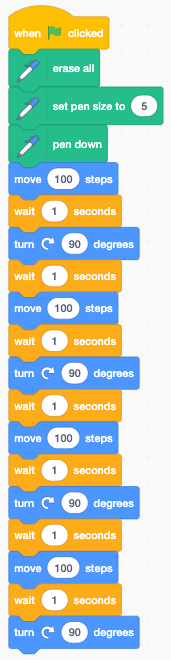
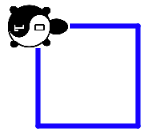

# Draw A Square (the hard way)
For our first lab we will draw a square with "Cody" our CoderDojo turtle.
Cody only needs to know three commands:

1. Move Forward 100 Steps
2. Turn Right 90 Degrees
3. Wait for A Second

Here is the final program we would like you to create:

After this program runs, you will see the following picture on the right of the screen:

To do this you will need to learn how to drag blocks from the left menu to the center panel.
You will need to learn how to snap the blocks in place and unsnap them if you want to reorder them.
When the blocks are ready to test you will need to click the green go flag:

## Link to Working Program
Here is a link to a working program on the MIT Scratch web site:

[Cody the Turtle Draws a Square](https://scratch.mit.edu/projects/400053670/)

## Experiments
What if you want to draw a Hexagon?  How would you need to change the program?