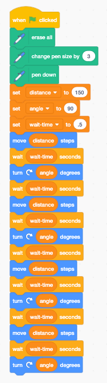

# Draw A Square With Variables
You will note that the distance we move, the angle we turn and the time we wait
are all repeated many times in the program.  It is hard to maintain the
code if we have to remember to change the program in many places.

What if we could change a single place in the program and have the entire
program change its behavior?  This is one use of variables.

Next, we will create a distance variable:

Next, look for the "Set Variable" block and move it under the pendown block.  Type in "100" to the value.

Next, drag the distance variable into the Move Foward Block

## Link to Working Program
Here is a link to a working program on the MIT Scratch web site:

[Using a Single Variable to Change the Distance](https://scratch.mit.edu/projects/404553981)

## Experiments

1. Can you create another variable for the right turn angle?
2. What happens if you change the angle from 90 to be 60 or 120?
3. Can you create a variable for the wait time?
4. What happens if you change the wait time to be .1?

## Solution

[Link to Scratch Program](https://scratch.mit.edu/projects/410593250/)