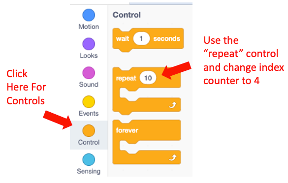
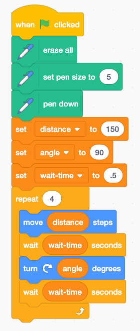
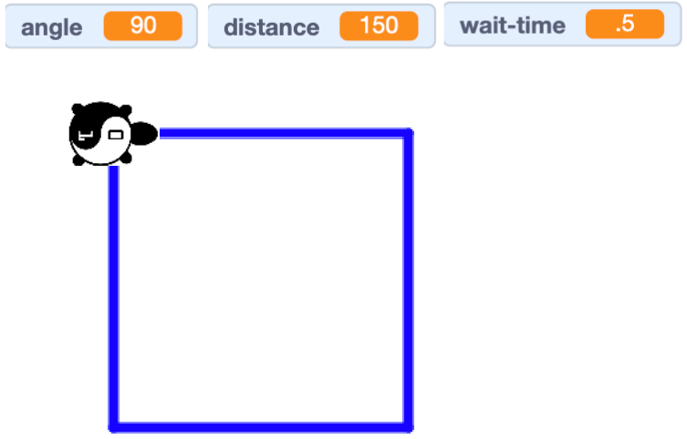

# Draw A Square With A Repeat Loop
In the last experiment we use variables to make our program easier to maintain.
Now let's use the repeat block to make our program even shorter!

Next we will use the repeat block from the Control menu.

Drag that below the set wait time block.

Press the green Go flat and you should see the following diagram.

## Experiments

1. Change the distance variable to a new value.
2. Change the angle variable to a new value from 30 to 120
3. Change the angle to be 60 and then the index to the repeat to be 6.  What shape do you have?
4. Can you make an Octagon?  An Octagon had eight sides.  Note that if you divide 360 by 8 you get 45.