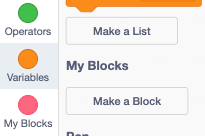
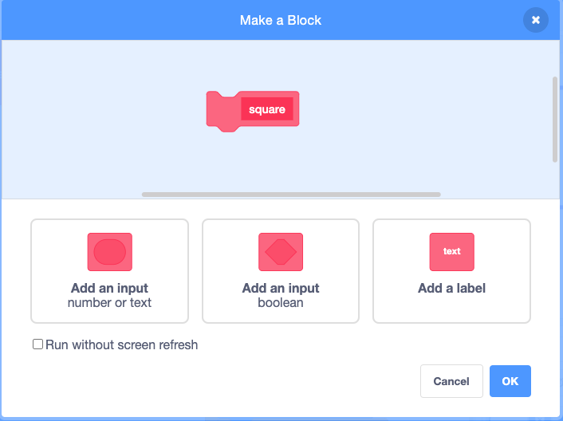
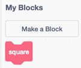
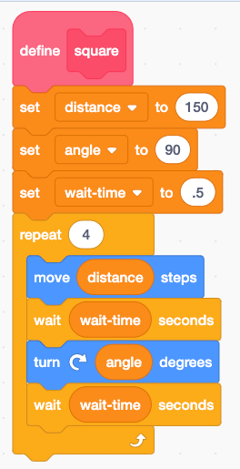
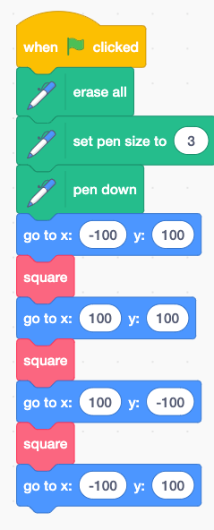
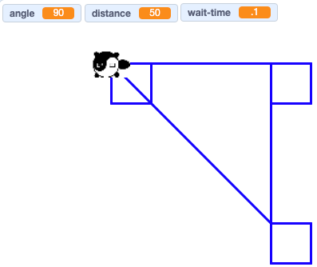

# Adding Your Own Function Blocks

Here is the Make a Block Menu

Click the Make a Block Button and Give it a name "square"

Note that you now have a new square block

Take a look at our new block function.  Note that we made
a few changes so that the blocks were a bit smaller.
We changed the distance variable to be

Now lets draw three different squares at different locations on the scree

The drawing should look like this:

## Link to Working Program
[Turtle Square Function](https://scratch.mit.edu/projects/410623444/)

Now put four squares on the screen in different locations
## Experiments

1. How would you modify the program so that there is no line drawn between the squares?
   (hint - there is a penup block)
2. Could you put the penup and pendown blocks in the function
