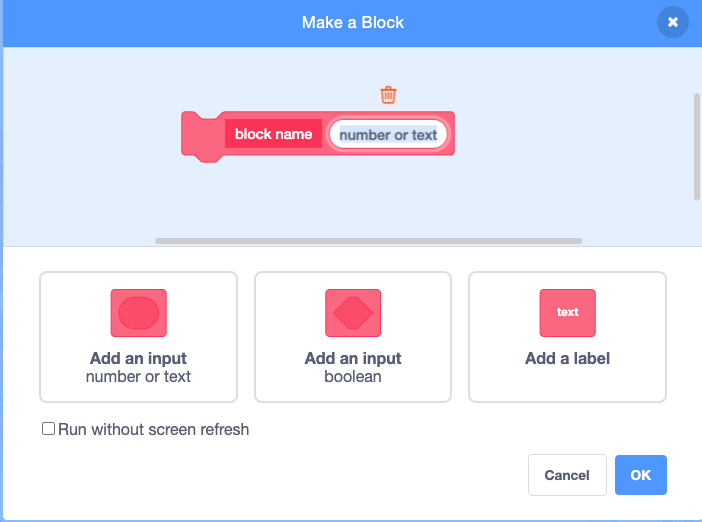
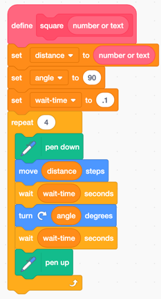
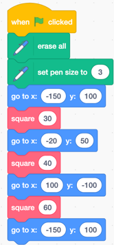
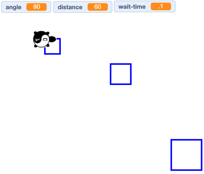

# Functions with Parameters
Before you begin this, you should be familiar with the previous [./functions.md]() lab.

Now we are going to add a new custom block, but this one will have both a name an a parameter
that we will use to change the size of the square.

## The Custom Square Block With A Size Parameter
Our goal is to create our own custom block that will draw a box of a given size.  The size will be passed as a parameter into our block function.  Each time we call
this function we can create a block of a differnet size just buy passing a different
number into the block.

## Draw Three Blocks of Different Sizes

Here is how the drawing should look:

## Examples
[Functions with Parameters Example Site](https://scratch.mit.edu/projects/410624370/)

## Experiments

1. Change the distance variable to a new value.
